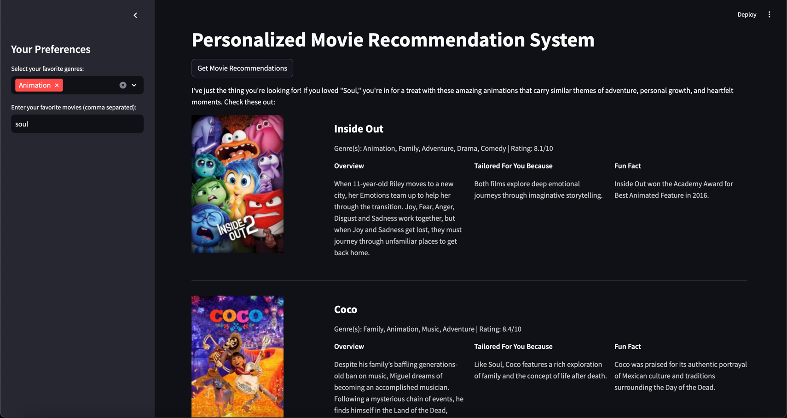

# Personalized Movie Recommendation System

This project is a personalized movie recommendation system that leverages The Movie Database (TMDb) API and OpenAI's GPT models. It provides users with customized movie recommendations based on their selected genres and favorite movies. The system uses machine learning techniques like TF-IDF and cosine similarity to enhance recommendation accuracy.


## Features

- **Fetch Movies Data:** Utilizes TMDb API to fetch and store movies data across various genres.
- **Personalized Recommendations:** Generates movie recommendations based on user-selected genres and favorite movies.
- **Machine Learning:** Incorporates TF-IDF and cosine similarity to find movies similar to the user's favorites.
- **Streamlit Integration:** Provides a user-friendly web interface using Streamlit.
- **ChatGPT Integration:** Enhances the recommendation system with conversational AI for better user interaction and movie suggestions.
- **Custom Styling:** Features a dark-themed UI with custom CSS for a modern look.

## Project Structure

```
.
├── fetch_movies.py       # Script to fetch and save movie data using TMDb API
├── movie_recommendation.py # Streamlit app to provide personalized movie recommendations
├── movies_dataset.csv    # CSV file containing movies data fetched from TMDb API
├── .env                  # Environment file for storing API keys
├── README.md             # Project documentation
```

## Requirements

- Python 3.x
- Required Python packages (install via `requirements.txt`):
  - requests
  - pandas
  - streamlit
  - openai
  - scikit-learn
  - tmdbv3api
  - python-dotenv

## Setup and Installation

1. **Install Dependencies:**

   ```bash
   pip install -r requirements.txt
   ```

2. **Set Up Environment Variables:**

   Create a `.env` file in the project root directory and add your API keys:

   ```
   TMDB_API_KEY=your_tmdb_api_key
   OPENAI_API_KEY=your_openai_api_key
   ```

3. **Run the Streamlit App:**

   Launch the Streamlit app to start getting movie recommendations:

   ```bash
   streamlit run movie_recommendation.py
   ```

6. **Interact with the App:**

   - Open your web browser and navigate to the provided URL.
   - Select your favorite genres and input your favorite movies.
   - Click the "Get Movie Recommendations" button to receive personalized suggestions.

## How It Works

1. **Data Fetching:** The `fetch_movies.py` script retrieves movie data from TMDb API, including details such as title, genre, overview, and ratings.
   
2. **Movie Recommendations:** The Streamlit app (`movie_recommendation.py`) uses the fetched movie data, applies TF-IDF and cosine similarity, and generates a list of movies that closely match the user's preferences.
   
3. **ChatGPT Integration:** The app sends a request to OpenAI's GPT model to further refine and enhance the recommendations, providing a conversational experience.

4. **UI/UX:** The app features a modern dark-themed UI, making it visually appealing and easy to use.
